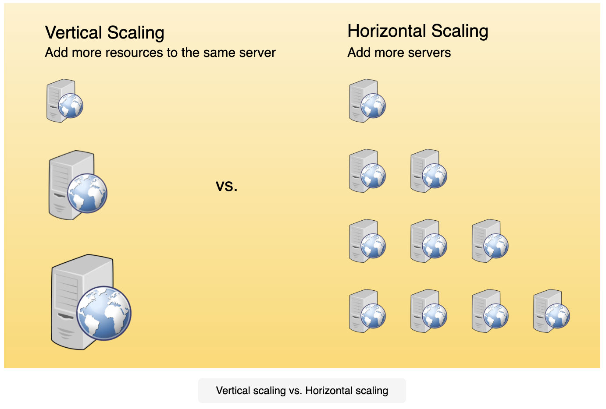

# Key characteristics of Distributed Systems:

## Scalability

Scalability is the capability of a system, process, or a network to grow and manage increased demand. A system may have to scale because of many reasons like increased data volume or increased amount of work, e.g., number of transactions. Generally, the performance of a system, althgouh designed (or claimed) to be scalable, declines with the system due to the management or environment cost.

**Horizontal vs. Vertical Scaling:** Horizontal scaling means that you scale by adding more servers into your pool of resources, whereas vertical scaling means that you scale by adding more power (CPU, RAM, storage, etc.) to an existing server. Good examples of horizontal scaling are Cassandra and MongoDB as they both provide an easy way to scale horizontally by adding more machines to meet growing needs. Similarly, a good example of vertical scaling is MySQL as it allows for an easy way to scale vertically by switching from smaller to bigger machines, however this process often involves downtime.

---

## Reliability

Reliability is the probability a system will fail in a given period. Take the example of a large electronic commerce store (like Amazon), where one of the primary requirements is that any user transaction should never be cancelled due to a failure of the machine that is running that transaction. For instance, if a user has added an item to their shopping cart, the system is expected not to lose it. If the server carrying the user's shopping cart fails, another server that has the exact replica of the shopping cart should replace it.

---

## Availability

Availability is the time a system remains operational to perform its required function in a specific period. Reliability is availability over time considering the full range of possible real-world conditions that can occur.

**Reliability vs. Availability:** If a system is reliable, it is available, however, if it is available, it is not necessarily reliable. Let's take the example of an online retail store that has 99.99% availability for the first 2 years after its launch, however, the system was launched without any information security testing. The customers are happy with the system, but they don't realize that it isn't very reliable as it is vulnerable to likely risks. In the 3rd year, the system experiences security incidents.

---

## Efficiency

Efficiency can be measured as the response time (latency) that denotes the delay to obtain the first item, and the throughput (or bandwidth) which denotes the number of items delivered in a given time unit (e.g., a second). The 2 measures correspond to:

- Number of messages globally sent by the nodes of the system.
- Size of messages representing the volume of data exchanges.

The complexity of operations supported by distributed data structures (e.g., searching for a specific key in a distributed index) can be characterized as a function of one of these cost units.

---

## Manageability

Manageability is how easy it is to operate and maintain. It is the simplicity and speed with which a system can be repaired or maintained. Early detection of faults can decrease or avoid system downtime. For example, some enterprise systems can automatically call a service center when the system experiences a system fault.
