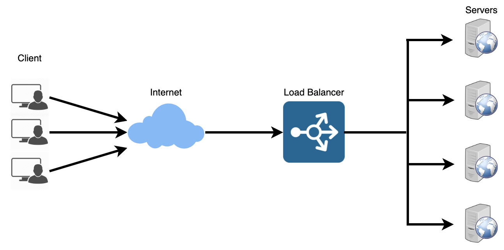
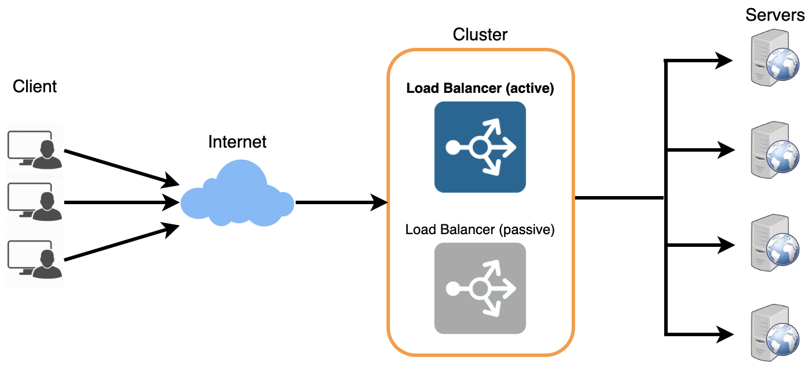

# Load Balancing

Load balancing helps to spread the traffic across a cluster of servers to improve responsiveness and availability of applications, websites, or databases. Typically a load balancer sits between the client and the server accepting incoming network and application traffic and distributing the traffic across multiple backend servers using various algorithms.

To utilize full scalability and redundancy, we can try to balance the load at each layer of the system. We can add LBs at 3 places:

- Between the user and the web server.
- Between the web servers and an internal platform layer, like application servers or cache servers.
- Between internal platform layer and database.

---

## Benefits of Load Balancing

- Users experience faster, uninterrupted service.
- Service providers experience less downtime and higher throughput.
- Load balancing makes it easier for system administrators to handle incoming requests which decreasing wait time for users.
- Smart load balancers provide benefits like predictive analytics that determine traffic bottlenecks before they happen.
- System administrators experience fewer failed or stressed components.

---

## Load Balancing Algorithms

**How does the load balancer choose the backend server?**
Load balancers consider 2 factors before forwarding a request to a backend server. They will first ensure that the server they choose is actually responding to requests, and then use a pre-configured algorithm to select one from the set of healthy servers.

**Health Checks:** Load balancers should only forward traffic to "healthy" backend servers. There is a variety of load balancing methods:

- **Least Connection Method:** Directs traffic to the server with the fewest active connections.
- **Least Response Time Method:** Directs traffic to the server with the fewest active connections and the lowest average response time.
- **Least Bandwidth Method:** Selects the server that is currently serving the least amount of traffic measured in Mbps.
- **Round Robin Method:** Cycles through a list of servers and sends each new request to the next server.
- **Weighted Round Robin Method:** Each server assigned a weight, servers with higher weights receive new connections before those with less weights.
- **IP Hash:** A hash of the IP address of the client is calculated to redirect the request to a server.

---

## Redundant Load Balancers

The load balancer can be a single point of failure; to overcome this,
a second load balancer can be connected to the first to form a cluster.

