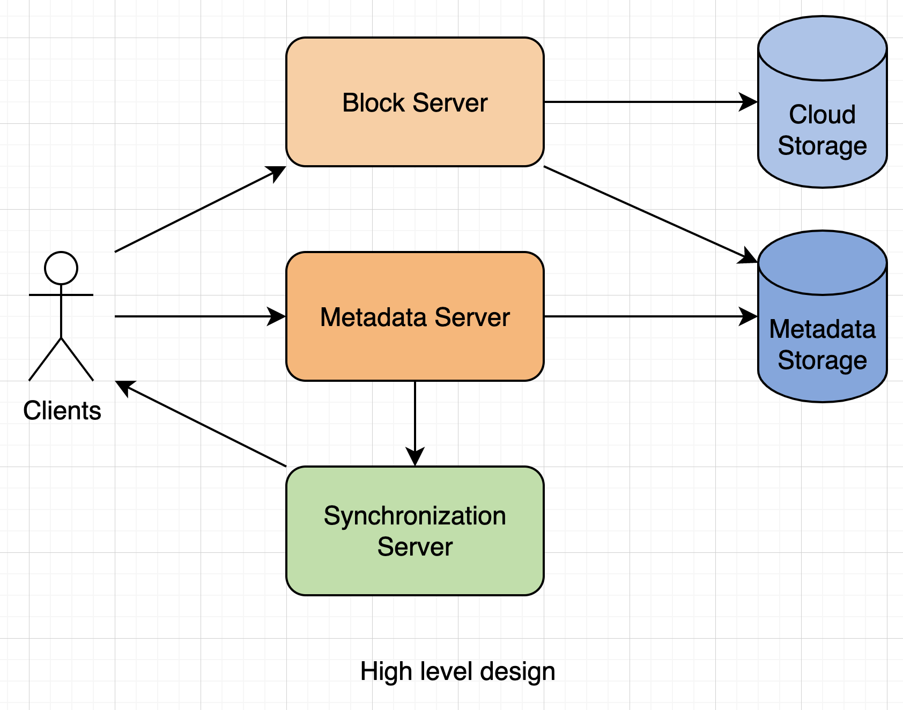
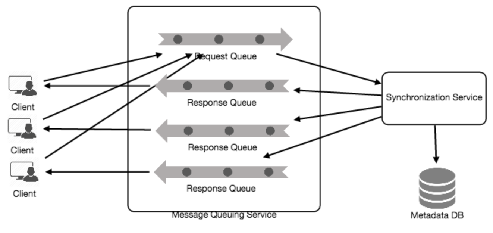
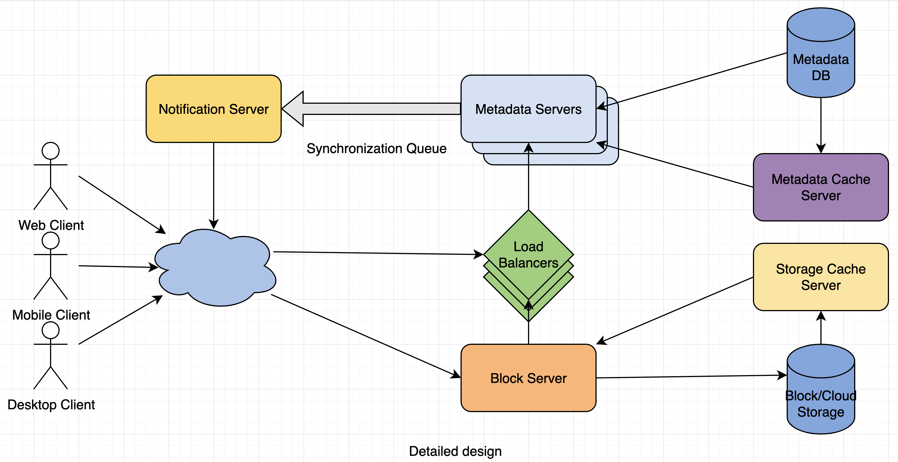

# Designing Dropbox

Let's design a file hosting service like Dropbox or Google Drive.

___

# 1. Why Cloud Storage

They simplify the storage and exchange of digital resources among multiple devices. Top benefits include availability, reliability and durability, and scalability.

___

# 2. Requirements and Goals of the System

Top-level requirements for our system:
1. Users should be able to upload and download their files/photos from any device.
2. Users should be able to share files or folders with other users.
3. Our service should support automatic synchronization between devices, i.e., after updating a file on one devide, it should get synchronized on all devices.
4. The system should support storing large files up to a GB.
5. ACID-ity is required. Atomicity, Consistency, Isolaton and Durability of all file operations should be guaranteed.
6. Our system should support offline editing. Users should be able to add/delete/modify files while offline, and as soon as they come online, all their changes should be synced to the remote servers and other online devices.

___

# 3. Some Design Considerations

- We should expect huge read and write volumes.
- Read to write ratio is expected to be nearly the same.
- Internally, files can be stored in small parts of chunks; this can provide a lot of beneits, i.e., all failed operations shall only be retried for smaller parts of a file.
- We can reduce the amount of data exchange by transferring updated chunks only.
- Keeping a local copy of the metadata (file name, size, etc.) with the client can save us a lot of round trips to the server.

___

# 4. Capacity Estimation and Constraints

- Let's assume we have 500 million total users, and 100 million daily active users.
- Let's assume that on average, each user connects from 3 different devices.
- On average if a user has 200 files/photos, we will have 100 billion total files.
- Let's also assume that we will have 1 million active connections per minute.

___

# 5. High Level Design

The user will specify a folder as the workspace on their device. Any file/photo/folder placed in this folder will be uploaded to the cloud, and whenever a file is modified or deleted, it will be reflected in the same way in the cloud storage.

At a high level, we need to store files and their metadata info like file name, file size, directory, etc., and who this file is shared with. So, we need some servers that can help the clients to upload/download files to cloud storage and some servers that can facilitate updating metadata about files and users. We also need some mechanism to notify all clients whenever an update happens so they can synchronize their files.

As shown in the diagram below, block servers will work with the clients to upload/download files from cloud storage and metadata servers will keep metadata of files updated in a SQL or NoSQL database. Synchronization servers will handle the workflow of notifying all clients about different changes for synchronization.

___

# 6. Component Design

### **a. Client**

The client application monitors the workspace folder on the user's machine and syncs all files/folders in it with the remote cloud storage.

Essential operations:
1. Upload and download files.
2. Detect file changes in the workspace folder.
3. Handle conflict due to offline or concurrent updates.

**How do we handle file transfer efficiently?** We can break each file into smaller chunks so that we transfer only those chunks that are modified and not the whole file.

**Should we keep a copy of metadata with client?** Keeping a local copy of metadata not only enables us to do offline updates, but also saves a lot of roundtrips to update remote metadata.

**How can clients efficiently listen to changes happening with other clients?**

1 solution could be that the clients periodically check with the server if there are any changes. Problem with this approach is that we will have a delay in reflecting changes locally as clients will be checking for changes periodically compared to a server notifying whenever there is some change.

A solution to the above problem could be to use HTTP long polling. With long polling, the client requests info from the server with the expectation that the server may not respond immediately. If the server has no new data for the client when the polll is received, instead of sending an empty response, the server holds the request open and waits for response info to become available.

Based on the above considerations, we can divide our client into the following 4 parts:

i. **Internal Metadata Database** will keep track of all the files, chunks, their versions, and their location in the file system.

ii. **Chunker** will split the files into smaller pieces called chunks.

iii. **Watcher** will monitor the local workspace folders and notify the Indexer of any action performed by the users, e.g., when users create, delete, or update files or folders.

iv. **Indexer** will process the events received from the Watcher and update the internal metadata database with info about the chunks of the modified files.

### **b. Metadata Database**

The metadata database is responsible for maintaining the versioning and metadata info about files/chunks, users, and workspaces. The metadata database can be a relational database such as MySQL, or a NoSQL database service such as DynamoDB. Since NoSQL data stores do not support ACID properties in favor of scalability and performance, we would need to incorporate the support for ACID properties programmatically in the logic of our synchronization service. However, using a relational database can simplify the implementation of the synchronization service.

The metadata database should be storing info about the following objects:
1. Chunks
2. Files
3. User
4. Devices
5. Workspace (sync folders)

### **c. Synchronization Service**

The synchronization service is the component that processes file updates made by a client and applies these changes to other subscribed clients.It is the most important part of the system architecture due to its critical role in managing the metadata and synchronizing users' files.

This service should be designed in such a way that it transmits less data between clients and the cloud storage to achieve a better response time. To meet this design goal, it can employ a differencing algorithm to reduce the amount of data that needs to be synchronized. Server and clients can calculate a hash (e.g., SHA-256) to see whether to update the local copy of a chunk or not.

For efficiency and scalability, we can consider using a communication middleware between clients and this service. This middleware should provide scalable message queuing and change notifications to support a high number of clients using pull or push stratgies.

### **d. Message Queuing Service**

A scalable message queuing service that supports asynchronous message-based communication between clients and the synchronization service best fits the requirements of our application.

This service will implement 2 types of queues in our system.
1. Request queue: clients' requests to update the metadata database will be sent to the request queue first, from there the sync service will take it to update metadata.
2. Response queue: deliver the update messages to each client, one for each subscribed client to share update messages.

### **e. Cloud/Block Storage**

Cloud/block storage stores chunks of files uploaded by the users. Clients directly interact with the storage to send and receive objects from it. Separation of the metadata from storage enables us to use any storage either in the cloud or in-house.

