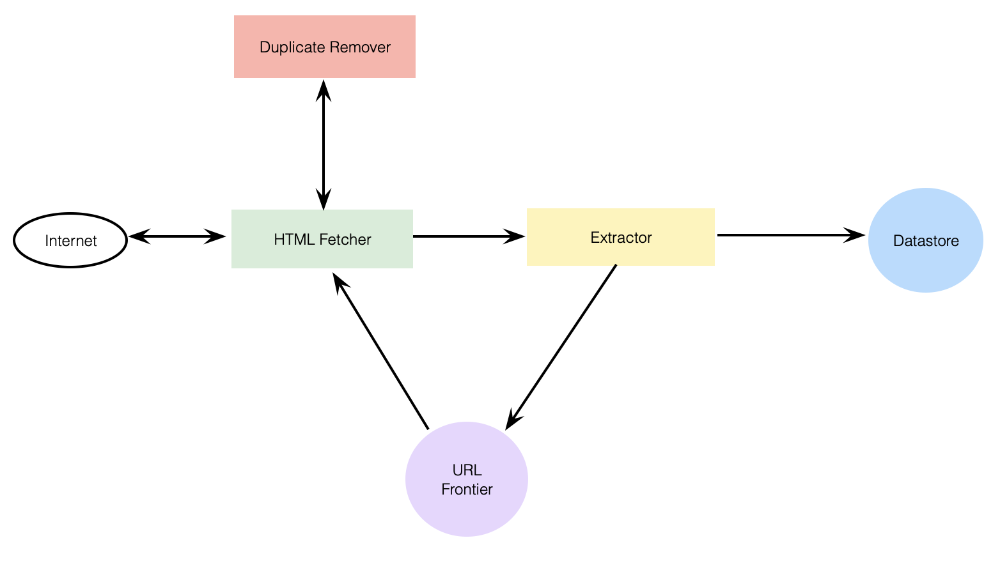
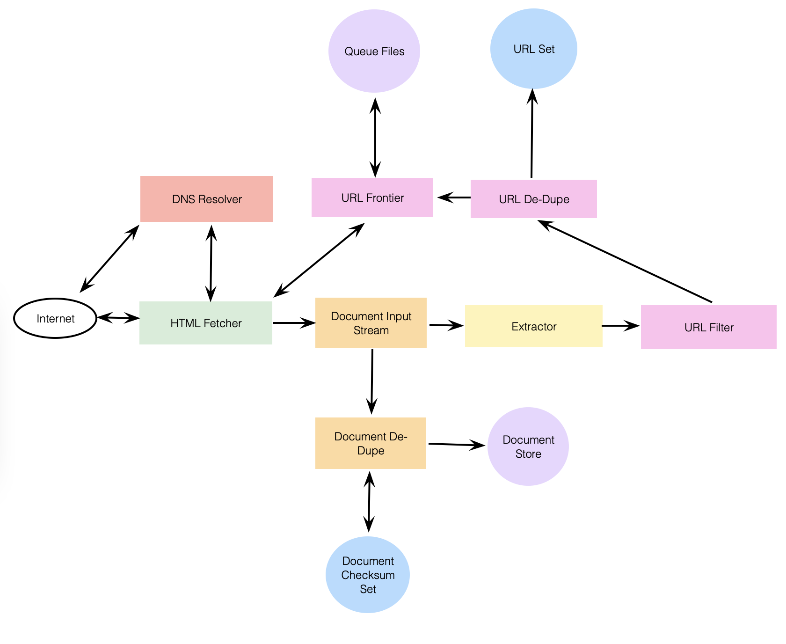

# Designing a Web Crawler

Systemically browse and download the web.

---

## 1. What is a Web Crawler?

Collects documents by recursively fetching links from a set of starting pages. Many sites, particularly search engines, use web crawling as a means of providing up-to-date data.

---

## 2. Requirements and Goals of the System

**Scalability:** Scalable such that it can crawl the entire web and can fetch hundreds of millions of web documents.

**Extensibility:** Designed in a modular way such that new functionality will be added to it.

---

## 3. Some Design Considerations

**Is it for HTML pages only? Or should we fetch other types of media, such as sound files, images, videos, etc.?** Assume HTML only, but should still be extensible and easy to add support for new media types.

**What protocols are we looking at?** Assume HTTP, but shouldn't be hard to extend to FTP and others.

**What is expected number of pages we will crawl?** Assume 1 billion websites, and since website can contain many URLs, assume upper bound of 15 billion different web pages.

---

## 4. Capacity Estimation and Constraints

If 15 billion pages within 4 weeks, assume `~6,200 pages/sec`.

**Storage:** Assume average page size of 100 KB, assume 500 bytes of metadata per page, total storage `~1.5 petabytes`. Assuming 70% capacity model: `~2.14 petabytes`.

---

## 5. High Level Design

Basic algorithm is to take a list of seed URLs as its input and repeatedly execute the following:
1. Pick a URL from unvisited URL list.
2. Determine IP address.
3. Establish connection to host to download corresponding document.
4. Parse document contents to look for new URLs.
5. Add new URLs to list of unvisited URLs.
6. Process downloaded document, e.g., store it or index its contents.
7. Go back to step 1.

### **How to Crawl?**

**Breadth first or depth first?** BFS usually used. DFS sometimes used for example if already established connection with website, might just DFS all URLs within this website to save some handshaking overhead.

**Path-ascending crawling:** Ascend every path in each URL it intends to crawl. For example, given seed URL of `http://foo.com/a/b/page.html`, will attempt to craw `/a/b/`, `/a/`, and `/`.

### **Difficulties in implementing efficient web crawler**

2 difficulties:

**1. Large volume of web pages:** Can only download a fraction of web pages at any time, hence critical that web crawler should be intelligent enough to prioritize download.

**2. Rate of change on web pages:** By the time crawler is downloading last page from a site, page may change, or new page may have been added.

Bare minimum crawler needs:

**1. URL Frontier:** To store list of URLs to download and also prioritize which URLs should be crawled first.
**2. HTTP Fetcher:** To retrieve a web page from the server.
**3. Extractor:** To extract links from HTML documents.
**4. Duplicate Eliminator:** To make sure the same content isn't extracted twice unintentionally.
**5. Datastore:** To store retrieved pages, URLs, and other metadata.

---

## 6. Detailed Component Design

First step is to remove an absolute URL from shared URL frontier for downloading. After downloading, document is placed into a Document Input Stream (DIS). Enables other modules to re-read document multiple times.

Once written to DIS, invoke dedupe test to determine whether this document has been seen before. If so don't process further and removes the next URL from the frontier.

Next, need to process downloaded document. Each doc can have a different MIME type like HTML page, image, video, etc., implement in a modular way so can easily add and support more types.

Next, HTML processing module extracts all links from page, each link converted to absolute URL and determined if should be downloaded. If passes filter, perform URL-seen test, if passes add to frontier.

### **1. URL Frontier:**

Contains all the URLs that remain to be downloaded. Since huge list, distribute frontier onto multiple servers. Assume hash function maps each URL to a server responsible for crawling it.

Politeness requirements to keep in mind for URL frontier:
1. Crawler shouldn't overload a server by downloading a lot of pages.
2. Shouldn't have multiple machines connecting a web server.

To implement these, add a collection of distinct FIFO sub-queues on each server. When a new URL needs to be added, FIFO sub-queue in which it's placed will be determined by URL's canonical hostname. Hash function can map each hostname to a thread number.

**How big will URL frontier be?** Size would be hundreds of millions of URLs, hence, need to store URLs on a disk.

### **2. Fetcher Module:**

Download doc corresponding to given URL using appropriate network protocol like HTTP. To avoid downloading robot.txt file on every request, maintain fixed-sized cache mapping hostnames to their robot's exclusion rules.

### **3. Document Input Stream**

Design enables same doc to be processed by multiple processing modules. To avoid downloading multiple times, cache doc locally using DIS.

DIS is an input stream that caches entire contents of the doc read from the internet. Also provides methods to re-read the doc. After extracting URL from frontier, workers pass URL to relevant protocol module, which initializes DIS from a network connection to contain doc's contents.

### **4. Document Dedupe Test:**

Calculate 64-bit checksum of every processed doc and store in database. For every new doc, compare checksum to all previous checksums to detect duplication. Can use MD5 or SHA.

**How big would the checksum store be?** If don't have enough memory available, can keep smaller LRU-based cache on each server with everything backed by persistent storage.

### **5. URL Filters:**

Customizable way to control set of URLs downloaded. Blacklist websites so crawler can ignore them.

### **6. Domain Name Resolution:**

Before contacting web server, crawler must use the Domain Name Service (DNS) to map web server's hostname to an IP address. To avoid repeated requests, start caching DNS results by building our local DNS server.

### **7. URL Dedupe Test:**

Store all URLs seen into canonical form in database. To reduce number of operations, keep an in-memory cache of popular URLs on each host shared by all threads.

