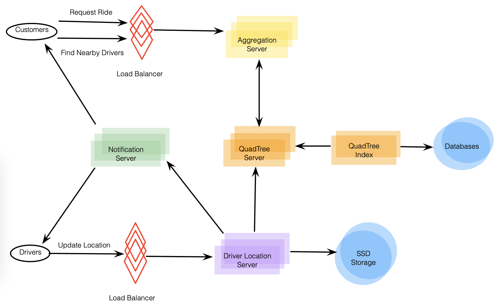

# Designing User Backend

Connects passengers who need a ride with drivers who have a car.

---

## 1. What is Uber?

Enables customers to book drivers for taxi rides.

---

## 2. Requirements and Goals of the System

2 types of users: 1) drivers and 2) customers.

- Drivers need to regularly notify service about their current location and availability to pick up passengers.
- Passengers get to see all nearby available drivers.
- Customer can request a ride, nearby drivers are notified.
- Once driver and customer accept ride, can constantly see each other's current location.
- Upon reaching destination, driver marks journey complete to become available for next ride.

---

## 3. Capacity Estimation and Constraints

- Assume 300 million customers, 1 million drivers with 1 million daily active customers, and 500,000 daily active drivers.
- Assume 1 million daily rides.
- Assume all active drivers notify current location every 3 seconds.
- Once customer puts in ride request, system should be able to contact drivers in real-time.

---

## 4. Basic System Design and Algorithm

Solution discussed in Designing Yelp but modified. Biggest difference is that there will be frequent updates to it. 2 issues:
1. Since active drivers report their location every 3 seconds, need to update QuadTree constantly, if ends up in another grid, need to move them to correct grid, and if grid full, need to re-partition.
2. Need quick mechanism to propagate current location of all nearby drivers to any active customer in that area.

**Do we need to modify QuadTree every time driver reports their location?** Yes but would be very costly. So, what if instead we keep the latest position reported by all drivers in a hash table and update QuadTree less frequently? Call this `DriverLocationHT`.

**How much memory we need for `DriverLocationHT`?** Need to store `DriveID`, and present and old location in hash table.
1. DriverID
2. Old latitude
3. Old longitude
4. New latitude
5. New longitude

**Do we need to distribute DriverLocationHT onto multiple servers?** For scalability, performance, and fault tolerance, we should. Can distribute based on `DriverID` to make distribution completely random. Call machines holding `DriverLocationHT` the Driver Location server. Will do 2 things:
1. As soon as server receives update for driver's location, broadcast info to all interested customers.
2. Notify respective QuadTree server to refresh driver's location (say every 10 sec).

**How can we efficiently broadcast driver's location to customers?** Can have **Push Model** where and a dedicated Notification Service to broadcast current location of drivers to all interested customers. Can build notification service on a publisher/subscriber model. When customer opens Uber app, they query server to find nearby drivers, so subscribe the customer and return list of drivers.

**How can we efficiently implement notification service?** Can use either HTTP long polling or push notifications.

**How will new publishers/drivers get added for a current customer?** To add a new customer/driver subscription dynamically, need to keep track of the area the customer is watching, becomes complicated. Can clients instead pull it from server?

**How about if clients pull info about nearby drivers from server?** Clients can send their current location, and server will find all nearby drivers to return. Upon receiving this info, client can update their screen to reflect current position. This solution is simpler.

**How would "Request Ride" use case work?**

1. Customer requests ride.
2. An aggregator servers takes request and asks QuadTree servers to return nearby drivers.
3. Aggregator server collects all results and sorts them by ratings.
4. Aggregator server sends notification to top (say 3) drivers simultaneously, whichever driver accepts request first will be assigned.
5. Once driver accepts, customer is notified.

---

## 5. Fault Tolerance and Replication

**What if Driver Location server or Notification Server dies?** Need replicas of these servers. Can also store this data in some persistent storage like SSDs that provide fast I/Os.
